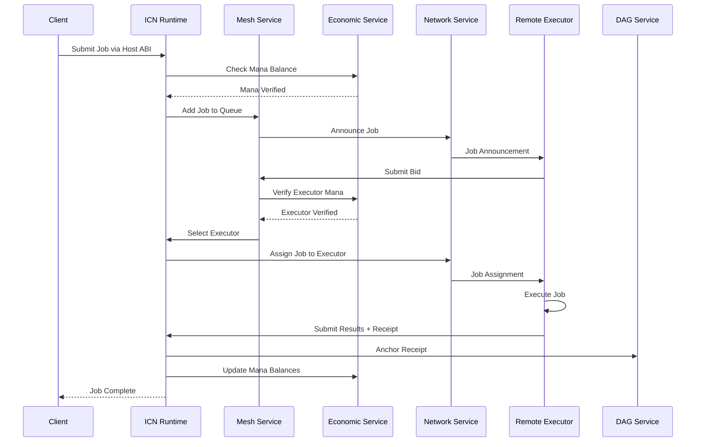
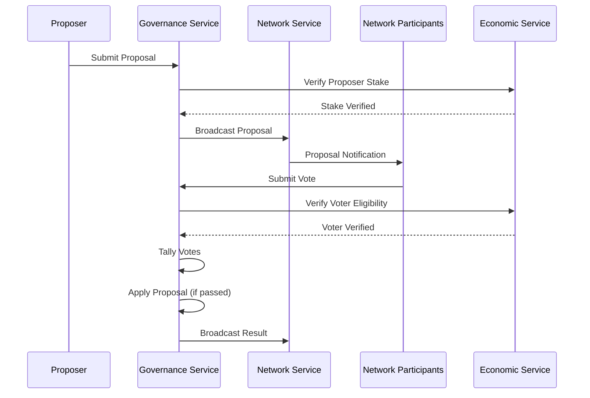

# ICN System Architecture Overview

## Introduction

The InterCooperative Network (ICN) is a federated compute, resource, and governance protocol designed to provide a programmable, governable, and resilient digital commons. This document provides a comprehensive overview of the system architecture, component interactions, and key design principles.

## Core Architectural Principles

### 1. Federated Design
ICN is built as a federation of autonomous nodes that can form cooperatives, communities, and larger federations. Each node maintains sovereignty while participating in the larger network.

### 2. Deterministic Execution
All core runtime, economic, and governance logic is designed to be deterministic, enabling verifiable computation and consistent state across the network.

### 3. Scoped Trust
All actions and resources are contextualized by Decentralized Identifiers (DIDs) representing individuals, communities, cooperatives, or federations.

### 4. Explicit Governance
Network operations, resource access, and protocol evolution are controlled by explicit, versioned policies defined in the Cooperative Contract Language (CCL) and compiled to WASM.

### 5. Dual Economic Model
- **Mana**: Regenerating capacity credits for compute metering and Sybil resistance
- **Tokenized Assets**: Support for fungible and non-fungible tokens representing goods and services

## System Components

### Core Runtime Layer

```
┌─────────────────────────────────────────────────────┐
│                 ICN Node                            │
├─────────────────────────────────────────────────────┤
│  HTTP API Server (icn-node)                        │
├─────────────────────────────────────────────────────┤
│  Host Runtime (icn-runtime)                        │
│  ┌─────────────┐ ┌──────────────┐ ┌──────────────┐ │
│  │ Host ABI    │ │ Job Manager  │ │ WASM Runtime │ │
│  └─────────────┘ └──────────────┘ └──────────────┘ │
├─────────────────────────────────────────────────────┤
│  Service Layer                                      │
│  ┌─────────┐ ┌─────────┐ ┌─────────┐ ┌───────────┐ │
│  │ Mesh    │ │ Economy │ │ Govern  │ │ Identity  │ │
│  └─────────┘ └─────────┘ └─────────┘ └───────────┘ │
├─────────────────────────────────────────────────────┤
│  Storage & Networking                               │
│  ┌─────────────┐ ┌─────────────────────────────────┐ │
│  │ DAG Store   │ │ P2P Network (libp2p)           │ │
│  └─────────────┘ └─────────────────────────────────┘ │
└─────────────────────────────────────────────────────┘
```

### Service Architecture

#### Identity Service (icn-identity)
- **Purpose**: DID management, credential verification, execution receipts
- **Key Functions**:
  - DID generation and resolution
  - Cryptographic key management
  - Verifiable credential handling
  - Execution receipt creation and validation

#### Governance Service (icn-governance)
- **Purpose**: Proposal management, voting, parameter governance
- **Key Functions**:
  - Proposal lifecycle management
  - Vote collection and tallying
  - Governance parameter updates
  - Quorum and consensus enforcement

#### Economic Service (icn-economics)
- **Purpose**: Mana management, token accounting, resource enforcement
- **Key Functions**:
  - Mana regeneration and spending
  - Token transfers and accounting
  - Resource policy enforcement
  - Economic parameter management

#### Mesh Service (icn-mesh)
- **Purpose**: Distributed job execution, executor selection, scheduling
- **Key Functions**:
  - Job submission and queuing
  - Executor bidding and selection
  - Job lifecycle management
  - Fault tolerance and recovery

#### DAG Service (icn-dag)
- **Purpose**: Content-addressed storage, receipt anchoring
- **Key Functions**:
  - Block storage and retrieval
  - Content addressing via CIDs
  - DAG traversal and queries
  - Multi-backend support (memory, file, distributed)

#### Network Service (icn-network)
- **Purpose**: P2P communication, peer discovery, message routing
- **Key Functions**:
  - Peer discovery via Kademlia DHT
  - Message broadcasting via Gossipsub
  - Direct peer messaging
  - Network topology management

## Data Flow Architecture

### Mesh Job Execution Pipeline



### Governance Proposal Workflow



## Network Architecture

### Federation Topology

ICN supports a hierarchical federation model:

```
Federation Level 4: Global ICN
├── Federation Level 3: Regional Federations
│   ├── Federation Level 2: Cooperative Alliances  
│   │   ├── Federation Level 1: Local Cooperatives
│   │   │   ├── Community A
│   │   │   └── Community B
│   │   └── Federation Level 1: Local Cooperatives
│   │       ├── Community C
│   │       └── Community D
│   └── Federation Level 2: Cooperative Alliances
│       └── ...
└── Federation Level 3: Regional Federations
    └── ...
```

### Node Types and Roles

#### Full Nodes
- Participate in all network functions
- Store complete DAG state
- Provide computational resources
- Participate in governance

#### Light Nodes
- Minimal resource requirements
- Query full nodes for data
- Can submit jobs but cannot execute
- Limited governance participation

#### Validator Nodes
- Enhanced security and uptime requirements
- Participate in consensus mechanisms
- Maintain network integrity
- Provide dispute resolution

## Security Architecture

### Identity and Authentication
- **DID-based Identity**: Each participant has a unique DID
- **Verifiable Credentials**: Capabilities and permissions via VCs
- **Cryptographic Signatures**: All transactions cryptographically signed
- **Reputation System**: Trust based on verifiable behavior history

### Economic Security
- **Mana System**: Prevents spam and resource abuse
- **Stake-based Governance**: Economic incentives align with network health
- **Tokenized Assets**: Enable complex economic interactions
- **Resource Metering**: Accurate accounting of computational resources

### Runtime Security
- **WASM Sandboxing**: Isolated execution environment
- **Host ABI Controls**: Limited, controlled access to node capabilities
- **Resource Limits**: CPU, memory, and storage constraints
- **Code Verification**: CCL policies compiled to verifiable WASM

## Scalability Considerations

### Horizontal Scaling
- **Mesh Distribution**: Jobs distributed across available nodes
- **DAG Sharding**: Large datasets split across multiple nodes
- **Federation Hierarchy**: Governance distributed across federation levels

### Performance Optimization
- **Async Runtime**: Non-blocking I/O throughout the system
- **Efficient Serialization**: Optimized data formats for network transmission
- **Local Caching**: Strategic caching of frequently accessed data
- **Batch Processing**: Grouping operations for efficiency

## Interoperability

### Protocol Standards
- **libp2p**: Standard P2P networking stack
- **IPFS/IPLD**: Content addressing and linking
- **W3C DIDs**: Decentralized identifier standards
- **WASM**: WebAssembly for portable execution

### API Interfaces
- **REST API**: HTTP-based node interaction
- **JSON-RPC**: Structured remote procedure calls
- **WebSocket**: Real-time event streaming
- **CLI Interface**: Command-line tool for developers

## Monitoring and Observability

### Metrics Collection
- **Prometheus**: Metrics aggregation and storage
- **Grafana**: Visualization and alerting
- **Custom Metrics**: ICN-specific performance indicators

### Audit Trail
- **Execution Receipts**: Verifiable proof of all operations
- **DAG Anchoring**: Immutable record of network state changes
- **Event Logging**: Comprehensive logging of system events

### Network Health
- **Peer Connectivity**: Monitor network topology health
- **Resource Utilization**: Track compute and storage usage
- **Economic Metrics**: Monitor mana flow and token circulation

## Development and Deployment

### Build System
- **Cargo Workspace**: Modular Rust crate organization
- **CI/CD Pipeline**: Automated testing and deployment
- **Cross-platform**: Support for multiple operating systems

### Configuration Management
- **Environment Variables**: Runtime configuration
- **Config Files**: Structured configuration management
- **Feature Flags**: Gradual feature rollout

### Testing Strategy
- **Unit Tests**: Individual component testing
- **Integration Tests**: Cross-component interaction testing
- **End-to-End Tests**: Complete workflow testing
- **Property-based Testing**: Automated test case generation

## Future Architecture Considerations

### Planned Enhancements
- **Advanced Sharding**: Improved data distribution strategies
- **Cross-chain Interoperability**: Bridge to other blockchain networks
- **Enhanced Privacy**: Zero-knowledge proofs and privacy-preserving protocols
- **Machine Learning**: Distributed ML training and inference

### Research Areas
- **Consensus Mechanisms**: Exploring alternatives to current approaches
- **Quantum Resistance**: Preparing for quantum computing threats
- **Edge Computing**: Optimizing for edge device participation
- **Environmental Impact**: Reducing energy consumption and carbon footprint

This architecture provides a solid foundation for a decentralized, cooperative digital commons while maintaining flexibility for future evolution and enhancement. 